# Documentacion 

* A continuacion se realizara el conjunto de actividades del `Lab 04`

    ## Ejecutar los dos contenedores 

    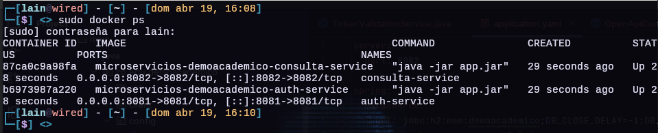

    ## Pruebas obligatorias en Swagger

    1. **URLs que debe verificarse**

        * Swagger de auth-service: `http://localhost:8081/swagger-ui.html`

            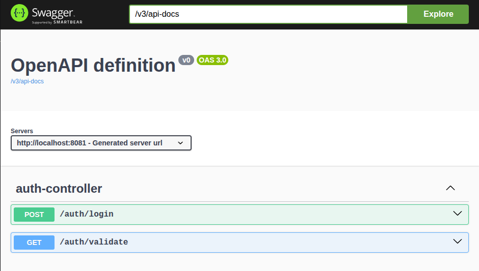

        * Swagger de consulta-service: `http://localhost:8082/swagger-ui.html`

            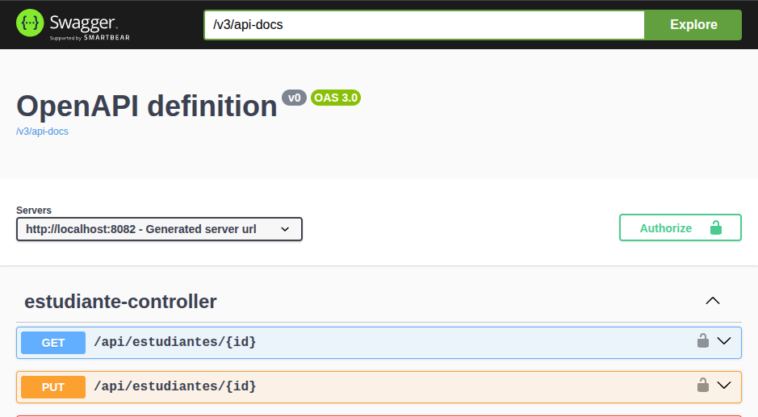

        * H2 Console de auth-service: `http://localhost:8081/h2-console`

            * No permite conexion: `webAllowOthers`

                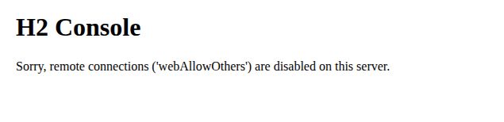

            * Para permitir agregar esto en el `application.yml`

                ```yaml
                  h2:
                    console:
                    settings:
                        web-allow-others: true
                    enabled: true
                    path: /h2-console
                ```

            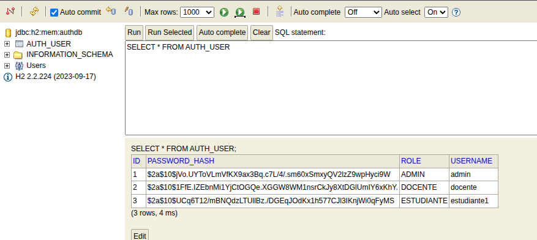

        * H2 Console de consulta-service: `http://localhost:8082/h2-console`

            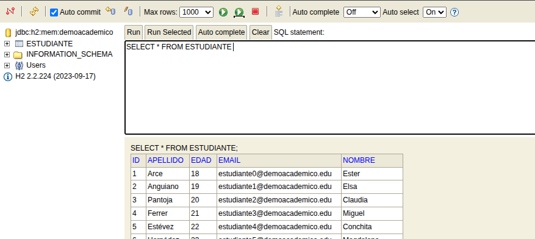


    
    ## Actividades minimas obligatorias


    1. **Realizar login existoso con un usuario válido**

        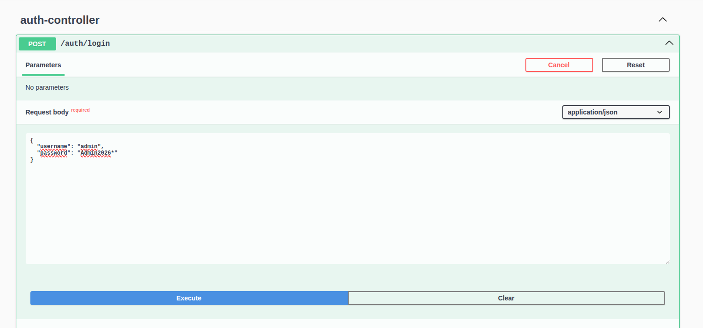

    2. **Realziar login fallido con contraseña incorrecta**

        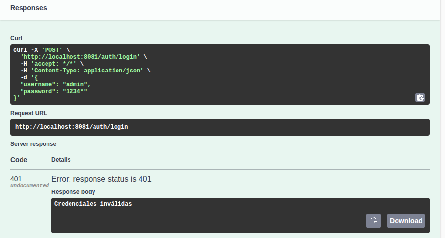

    3. **Validar manualmente un token válido**

        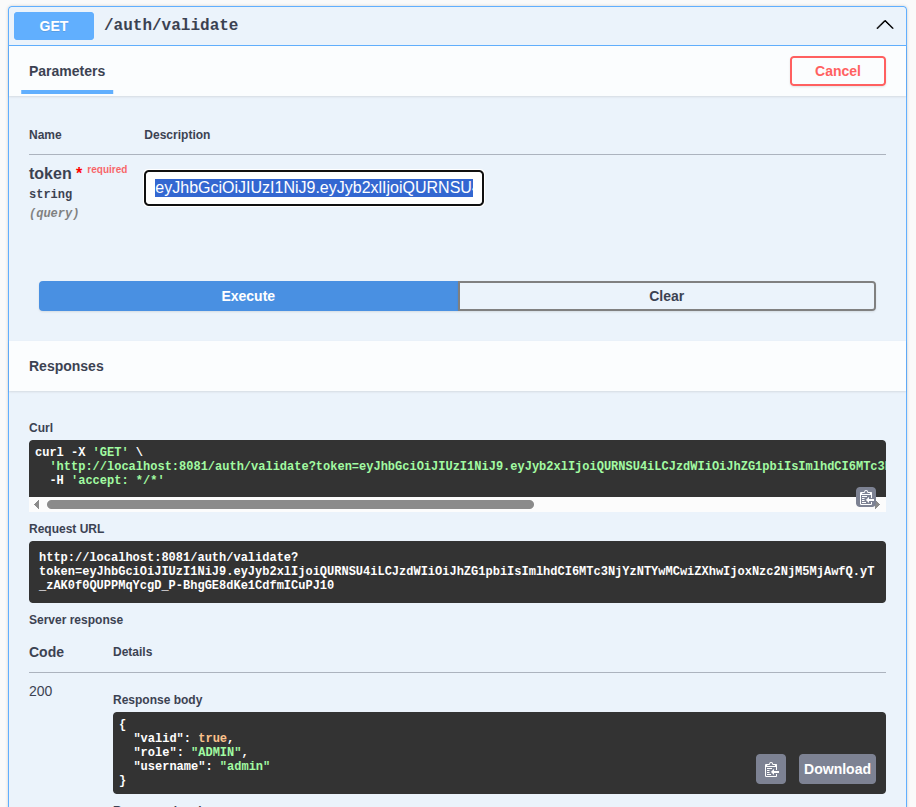

    
    4. **Consumir GET /api/estudiantes con un token válido.**

        
        * Colocar token en Authorize

            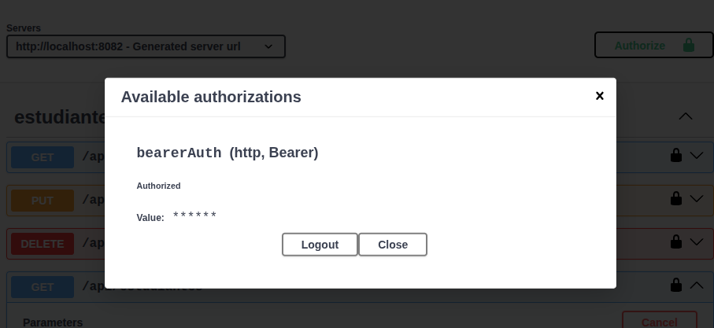

        * Ejecutar GET `/api/estudiantes`

            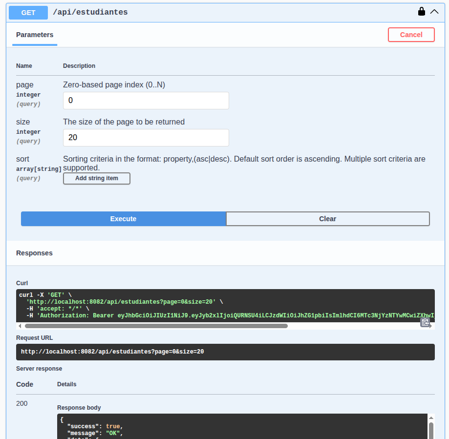


    5. **Consumir GET /api/estudiantes sin autorizar en Swagger.**

        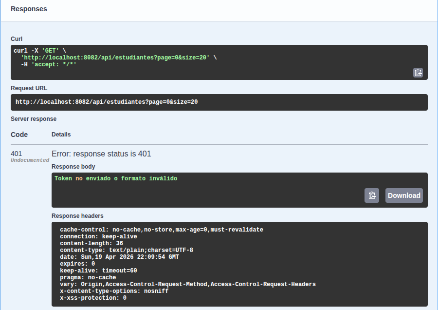

    6. **Consumir GET /api/estudiantes con token inválido.**

        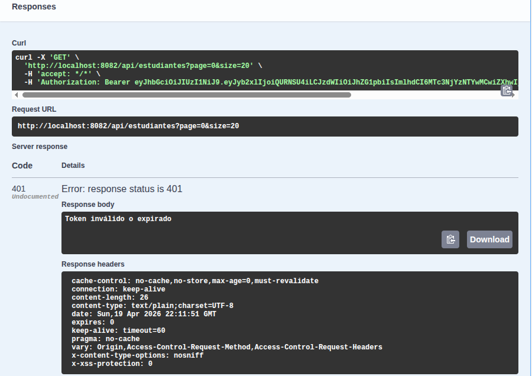